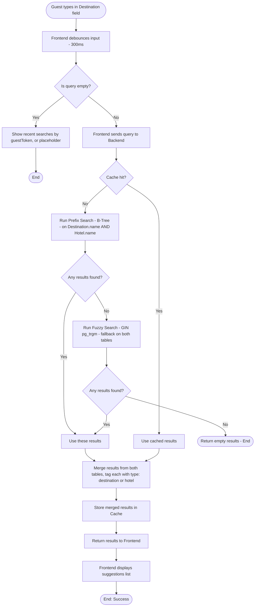
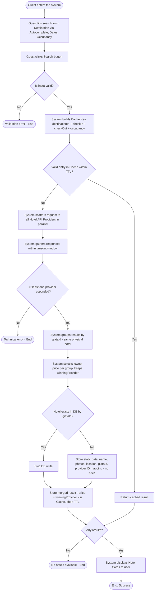
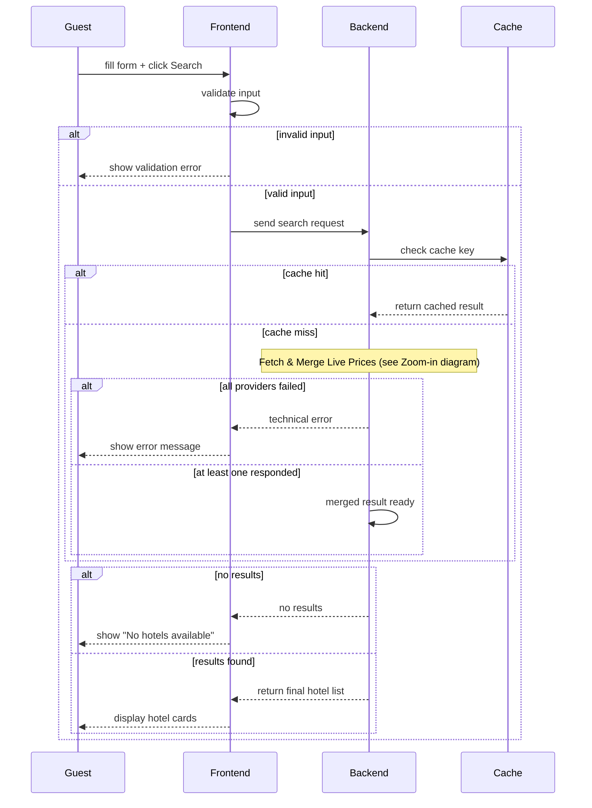
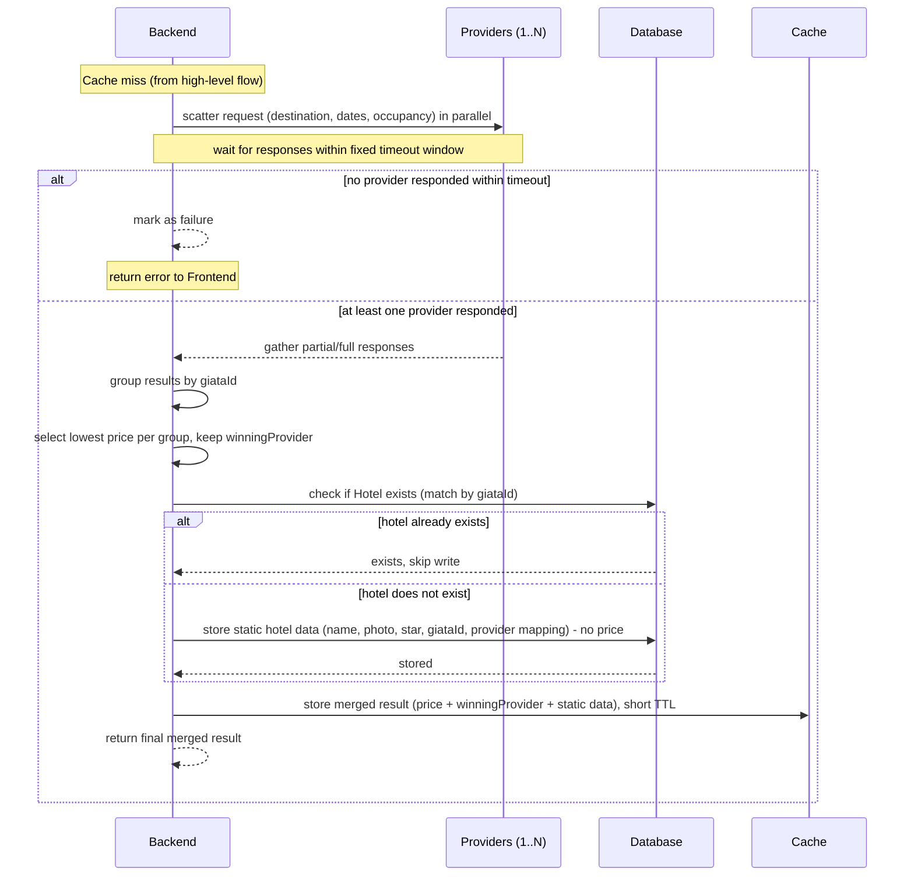
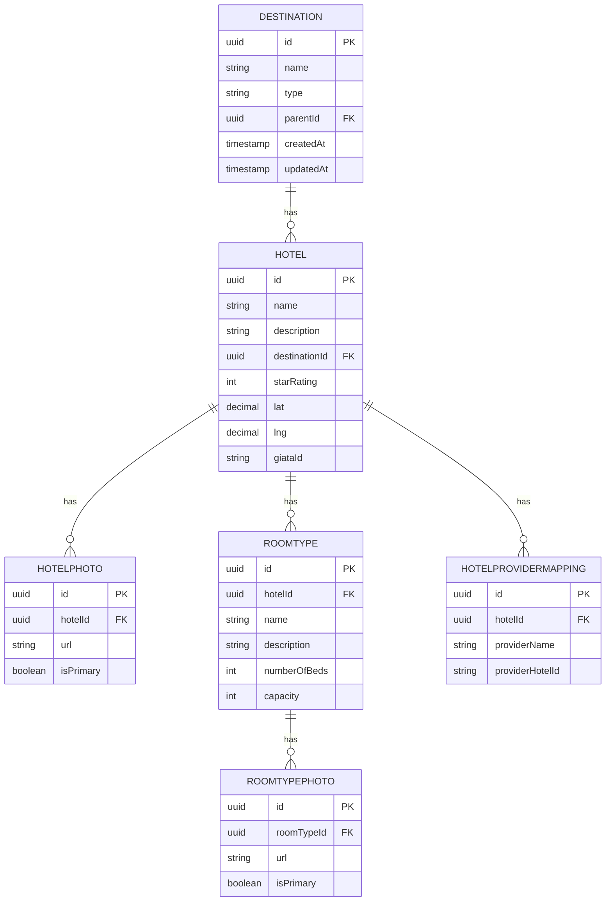

# 🏨 Booking System 

A full-scale, multi-tenant travel reservation platform for **hotels and flights**, sourced from external third-party providers in real time. Built as a team mentorship project, with each engineer owning a distinct service domain.

---

## 🌍 Project Overview

The platform connects three system actors to deliver an end-to-end booking experience:

- **Guest User** — unauthenticated browser exploring destinations and live rates, tracked via a session-based `guestToken`.
- **Registered User** — authenticated user with persistent search history, saved preferences, and profile/booking management.
- **System / Third-Party API Providers** — external hotel and flight suppliers queried dynamically via asynchronous request aggregation.

---

### Architecture at a Glance

```text
       ┌─────────────────────────────────────────────────────────────┐
       │                Core Hotel & Flight System                   │
       └──────────────────────────────┬──────────────────────────────┘
                                       │
 ┌──────────────────┬─────────────────┼─────────────────┬──────────────────┐
 │                   │                 │                 │                  │
 ▼                   ▼                 ▼                 ▼                  ▼
[Auth & Identity]  [Search & Filter] [Booking Engine]  [Payments]    [Notifications]
 (Keycloak/OAuth)     (My Scope)    (Hotels/Flights) (3rd-Party)   (Event-Driven)
```

---

### The 7 Service Domains

1. **User Registration & Authentication** — identity management via Keycloak, supporting Social Login (Google/Facebook), SSO, and OAuth 2.0 / OpenID Connect.
2. **Search & Filter Engine** — high-throughput search aggregator using a Scatter & Gather pattern against external provider APIs, with dual-level Redis/Postgres caching. *(My scope — see below)*
3. **Booking Management** — multi-entity reservation engine for hotel/flight holds, cancellations, and history tracking.
4. **Payment Integration** — asynchronous payment gateways with status verification and receipt generation.
5. **Notification System** — event-driven email/SMS confirmations and promotional pushes.
6. **Customer Management** — user preferences, addresses, reviews, and support.
7. **Dashboard & Reporting** — system-wide transactional metrics and analytics.

---

# 🎯 Use Cases

## Use Case 1: Destination & Hotel Autocomplete

**Actors:** Guest/User (Primary), Database (Secondary)

**Main Flow (Mermaid Flowchart):**



**Pseudocode:**

```
FUNCTION autocomplete(query, guestToken):

    IF query IS EMPTY:
        recentSearches = Database.getRecentSearches(guestToken, limit=5)
        RETURN recentSearches OR show_placeholder()

    cacheKey = "autocomplete:" + query
    cachedResult = Cache.get(cacheKey)
    IF cachedResult EXISTS:
        RETURN cachedResult

    destinationResults = Database.query(
        "SELECT * FROM Destination WHERE name LIKE query + '%' LIMIT 10"
    )
    hotelResults = Database.query(
        "SELECT * FROM Hotel WHERE name LIKE query + '%' LIMIT 10"
    )

    IF destinationResults IS EMPTY AND hotelResults IS EMPTY:
        destinationResults = Database.query(
            "SELECT * FROM Destination WHERE name % query LIMIT 10"
        )
        hotelResults = Database.query(
            "SELECT * FROM Hotel WHERE name % query LIMIT 10"
        )

    IF destinationResults IS EMPTY AND hotelResults IS EMPTY:
        RETURN empty_result()

    mergedResults = []
    FOR each d IN destinationResults:
        mergedResults.ADD({ type: "destination", id: d.id, name: d.name })
    FOR each h IN hotelResults:
        mergedResults.ADD({ type: "hotel", id: h.id, name: h.name, destinationId: h.destinationId })

    Cache.set(cacheKey, mergedResults, ttl = SHORT_TTL)
    RETURN mergedResults
```

---

## Use Case 2: Search Hotel

**Actors:** Guest/User (Primary), Hotel API Providers — N providers (Secondary)

**Preconditions:**

1. User does not need to be logged in (Guest access via guestToken)
2. System is successfully connected to at least one Hotel API Provider
3. User has selected a valid Destination from Autocomplete results
4. User has entered check-in/check-out dates and specified occupancy

**Business Rules:**

- If no check-out date is set → default to check-in date + 1 day
- Default: 1 Adult, 1 Room if occupancy is not specified
- At least 1 adult required per room
- "Search" button is disabled until Destination + check-in date are set

**Main Flow (Mermaid Flowchart):**



---

**Sequence Diagram — High-level (Mermaid):**



---

**Sequence Diagram — Zoom-in: Fetch Live Prices (Mermaid):**



**Pseudocode:**

```
FUNCTION searchHotel(destinationId, checkIn, checkOut, occupancy):

    IF destinationId IS NULL OR checkIn IS NULL:
        RETURN error("Please select a destination and check-in date")

    IF checkOut IS NULL:
        checkOut = checkIn + 1 DAY

    IF occupancy IS NULL:
        occupancy = { adults: 1, rooms: 1 }

    cacheKey = buildCacheKey(destinationId, checkIn, checkOut, occupancy)
    cachedResult = Cache.get(cacheKey)
    IF cachedResult EXISTS:
        RETURN cachedResult

    providerResponses = []
    PARALLEL FOR each provider IN HotelProviders:
        TRY:
            response = provider.fetchHotels(destinationId, checkIn, checkOut, occupancy)
            providerResponses.ADD(response)
        CATCH (timeout OR error):
            CONTINUE
        WAIT UP TO timeoutLimit

    IF providerResponses IS EMPTY:
        RETURN error("Unable to fetch hotels right now, please try again")

    groupedByGiataId = {}
    FOR each response IN providerResponses:
        FOR each hotelOffer IN response.hotels:
            groupedByGiataId[hotelOffer.giataId].ADD(hotelOffer)

    finalResults = []
    FOR each (giataId, offers) IN groupedByGiataId:
        bestOffer = offers.MIN_BY(price)

        existingHotel = Database.findByGiataId(giataId)
        IF existingHotel IS NULL:
            newHotel = Database.insert(Hotel, {
                name: bestOffer.name, description: bestOffer.description,
                destinationId: destinationId, starRating: bestOffer.starRating,
                lat: bestOffer.lat, lng: bestOffer.lng, giataId: giataId
            })
            Database.insert(HotelProviderMapping, {
                hotelId: newHotel.id, providerName: bestOffer.providerName,
                providerHotelId: bestOffer.providerHotelId
            })
            hotelData = newHotel
        ELSE:
            hotelData = existingHotel

        finalResults.ADD({
            hotel: hotelData, price: bestOffer.price,
            winningProvider: bestOffer.providerName
        })

    IF finalResults IS EMPTY:
        RETURN noResultsMessage()

    Cache.set(cacheKey, finalResults, ttl = SHORT_TTL)
    RETURN finalResults
```

---

# Entity Relationships (Final Version)

```
Destination: id (PK), name (+Trigram Index), type, parentId (FK self, nullable), createdAt, updatedAt

Hotel: id (PK), name (+Trigram Index), description, destinationId (FK), starRating, lat, lng, giataId (UNIQUE)

HotelPhoto: id (PK), hotelId (FK), url, isPrimary

RoomType: id (PK), hotelId (FK), name, description, numberOfBeds, capacity

RoomTypePhoto: id (PK), roomTypeId (FK), url, isPrimary

HotelProviderMapping: id (PK), hotelId (FK), providerName, providerHotelId
```

**ER Diagram (Mermaid):**



---

# Guest Token → User Account Migration

```
1. First site visit → Backend generates a guestToken, stores it in a Cookie
2. Any activity (search, hold) done as guest → recorded as (guestToken, userId = NULL)
3. User signs up / logs in → browser automatically attaches the guestToken
   with the same Login Request
4. Backend validates login credentials, retrieves the userId
5. Backend finds the guestToken attached to the request → runs an UPDATE
   on all records (userId = NULL, guestToken = "xyz") → (userId = [new account])
6. From this point forward, any new activity is recorded directly under userId
```
